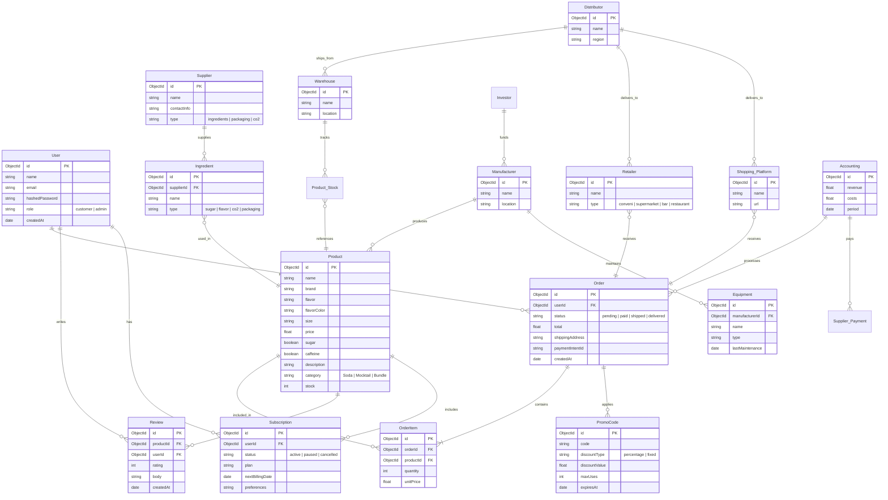

# Entity Relationship Diagram — FairFizz E-Commerce System

```mermaid
erDiagram
    User ||--o{ Order : places
    User ||--o{ Review : writes
    User ||--o{ Subscription : has

    Order ||--|{ OrderItem : contains
    Order ||--o{ PromoCode : applies

    Product ||--o{ OrderItem : included_in
    Product ||--o{ Review : has
    Product ||--o{ Subscription : includes

    Ingredient }o--|| Product : used_in
    Supplier ||--o{ Ingredient : supplies

    Manufacturer ||--o{ Product : produces
    Manufacturer ||--o{ Equipment : maintains

    Warehouse ||--o{ Product_Stock : tracks
    Product_Stock }o--|| Product : references

    Distributor ||--o{ Warehouse : ships_from
    Distributor ||--o{ Retailer : delivers_to
    Distributor ||--o{ Shopping_Platform : delivers_to

    Retailer }o--|| Order : receives
    Shopping_Platform }o--|| Order : receives

    Accounting ||--o{ Order : processes
    Accounting ||--o{ Supplier_Payment : pays
    Investor ||--o{ Manufacturer : funds

    User {
        ObjectId id PK
        string name
        string email
        string hashedPassword
        string role "customer | admin"
        date createdAt
    }

    Product {
        ObjectId id PK
        string name
        string brand
        string flavor
        string flavorColor
        string size
        float price
        boolean sugar
        boolean caffeine
        string description
        string category "Soda | Mocktail | Bundle"
        int stock
    }

    Order {
        ObjectId id PK
        ObjectId userId FK
        string status "pending | paid | shipped | delivered"
        float total
        string shippingAddress
        string paymentIntentId
        date createdAt
    }

    OrderItem {
        ObjectId id PK
        ObjectId orderId FK
        ObjectId productId FK
        int quantity
        float unitPrice
    }

    Review {
        ObjectId id PK
        ObjectId productId FK
        ObjectId userId FK
        int rating
        string body
        date createdAt
    }

    Subscription {
        ObjectId id PK
        ObjectId userId FK
        string status "active | paused | cancelled"
        string plan
        date nextBillingDate
        string preferences
    }

    PromoCode {
        ObjectId id PK
        string code
        string discountType "percentage | fixed"
        float discountValue
        int maxUses
        date expiresAt
    }

    Supplier {
        ObjectId id PK
        string name
        string contactInfo
        string type "ingredients | packaging | co2"
    }

    Ingredient {
        ObjectId id PK
        ObjectId supplierId FK
        string name
        string type "sugar | flavor | co2 | packaging"
    }

    Warehouse {
        ObjectId id PK
        string name
        string location
    }

    Manufacturer {
        ObjectId id PK
        string name
        string location
    }

    Equipment {
        ObjectId id PK
        ObjectId manufacturerId FK
        string name
        string type
        date lastMaintenance
    }

    Retailer {
        ObjectId id PK
        string name
        string type "conveni | supermarket | bar | restaurant"
    }

    Shopping_Platform {
        ObjectId id PK
        string name
        string url
    }

    Distributor {
        ObjectId id PK
        string name
        string region
    }

    Accounting {
        ObjectId id PK
        float revenue
        float costs
        date period
    }
```
